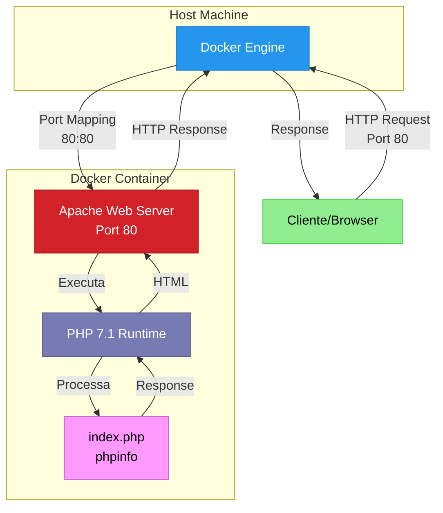
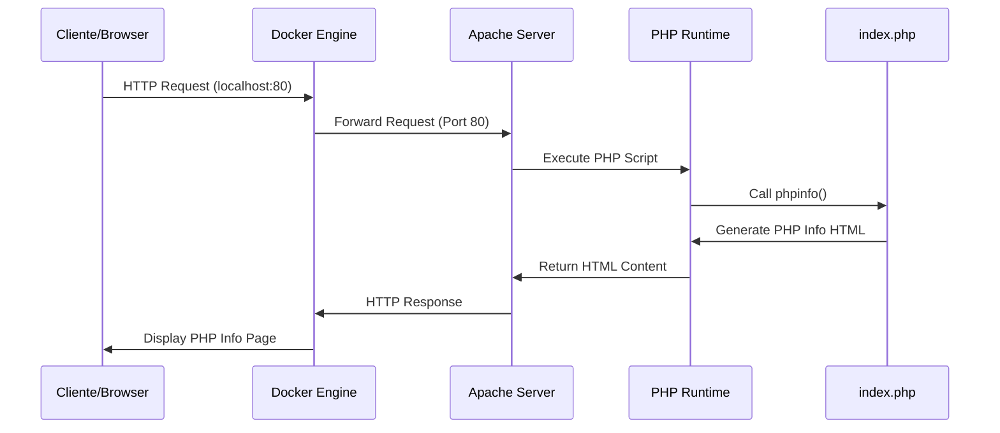
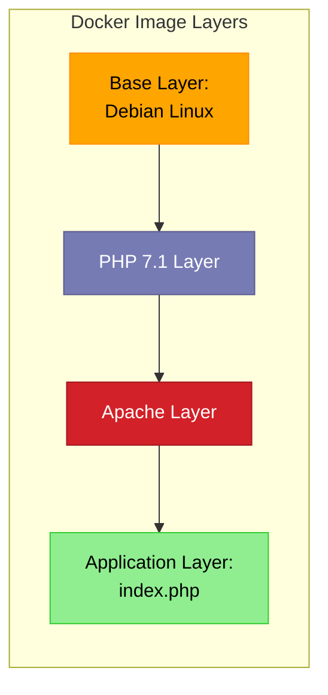

# 🐳 Hello Docker - Aplicação PHP Containerizada

<div align="center">


**Uma aplicação PHP containerizada para demonstrar os conceitos fundamentais do Docker**

[Demonstração](#-uso) • [Instalação](#-instalação) • [Documentação](#-índice) • [Contribuir](#-guia-de-contribuição)

</div>

---

## 📋 Índice

- [Sobre o Projeto](#-sobre-o-projeto)
- [Funcionalidades Principais](#-funcionalidades-principais)
- [Tecnologias Utilizadas](#-tecnologias-utilizadas)
- [Arquitetura do Sistema](#-arquitetura-do-sistema)
- [Pré-requisitos](#-pré-requisitos)
- [Instalação](#-instalação)
- [Configuração](#-configuração)
- [Uso](#-uso)
  - [Exemplos Básicos](#exemplos-básicos)
  - [Exemplos Avançados](#exemplos-avançados)
- [Estrutura de Diretórios](#-estrutura-de-diretórios)
- [API/Endpoints](#-apiendpoints)
- [Variáveis de Ambiente](#-variáveis-de-ambiente)
- [Docker](#-docker)
- [Troubleshooting](#-troubleshooting)
- [Guia de Contribuição](#-guia-de-contribuição)
- [Testes](#-testes)
- [Roadmap](#-roadmap)
- [Licença](#-licença)
- [Autores e Contato](#-autores-e-contato)

---

## 🎯 Sobre o Projeto

**Hello Docker** é uma aplicação web PHP containerizada desenvolvida como projeto educacional para demonstrar os conceitos fundamentais de containerização com Docker. Este projeto serve como ponto de partida para desenvolvedores que desejam aprender sobre:

- 🐳 Containerização de aplicações web
- 🏗️ Criação de imagens Docker customizadas
- 📦 Distribuição e execução de containers
- 🔧 Configuração de ambientes isolados
- 🚀 Deploy de aplicações PHP com Apache

A aplicação utiliza o PHP Info para exibir informações completas sobre a configuração do PHP, servidor web Apache e ambiente de execução, permitindo aos desenvolvedores entenderem o ambiente containerizado em tempo real.

### 🎓 Contexto Educacional

Este projeto foi desenvolvido como parte do **Curso Docker Devmedia**, focando em:
- Conhecer os conceitos fundamentais do Docker
- Criar imagens a partir de Dockerfiles
- Executar containers com Apache e PHP
- Implementar um "Hello World" utilizando Docker

---

## ⭐ Funcionalidades Principais

- ✅ **Exibição de PHP Info**: Visualização completa das configurações do PHP
- ✅ **Servidor Apache**: Web server Apache totalmente configurado
- ✅ **Containerização Completa**: Ambiente isolado e reproduzível
- ✅ **Deploy Simplificado**: Um comando para executar toda a aplicação
- ✅ **Portabilidade**: Executa em qualquer sistema com Docker instalado
- ✅ **Ambiente Isolado**: Não interfere com outras instalações PHP
- ✅ **Configuração Zero**: Pronto para uso sem configurações adicionais
- ✅ **Hot Reload**: Suporte para desenvolvimento com volumes

---

## 🛠️ Tecnologias Utilizadas

### Core Technologies
- **[PHP 7.1](https://www.php.net/)** - Linguagem de programação server-side
- **[Apache 2.4](https://httpd.apache.org/)** - Servidor web HTTP
- **[Docker](https://www.docker.com/)** - Plataforma de containerização

### Imagem Base
- **php:7.1-apache** - Imagem oficial do PHP com Apache pré-configurado

### Ferramentas de Desenvolvimento
- Docker Engine 20.10+
- Docker Compose (opcional)

---

## 🏗️ Arquitetura do Sistema

### Diagrama de Arquitetura



### Fluxo de Dados



### Estrutura de Camadas



---

## 📋 Pré-requisitos

Antes de começar, certifique-se de ter os seguintes requisitos instalados em sua máquina:

### Obrigatórios

- **Docker Engine** 20.10 ou superior
  ```bash
  docker --version
  # Docker version 20.10.0 ou superior
  ```

### Opcionais

- **Docker Compose** 1.29 ou superior (para orquestração avançada)
  ```bash
  docker-compose --version
  ```

- **Git** (para clonar o repositório)
  ```bash
  git --version
  ```

### Requisitos de Sistema

| Componente | Mínimo | Recomendado |
|------------|--------|-------------|
| RAM | 512 MB | 1 GB |
| Espaço em Disco | 500 MB | 1 GB |
| CPU | 1 core | 2 cores |
| Sistema Operacional | Linux, macOS, Windows 10+ | Linux, macOS, Windows 10+ |

---

## 🚀 Instalação

### Método 1: Clone do Repositório (Recomendado)

```bash
# Clone o repositório
git clone https://github.com/jrmoreiram/hello-docker.git

# Navegue até o diretório do projeto
cd hello-docker

# Construa a imagem Docker
docker build -t hello-docker:latest .

# Execute o container
docker run -d -p 80:80 --name hello-docker-app hello-docker:latest
```

### Método 2: Download Manual

```bash
# Crie um diretório para o projeto
mkdir hello-docker && cd hello-docker

# Baixe os arquivos necessários
# Copie o Dockerfile e index.php para este diretório

# Construa a imagem
docker build -t hello-docker:latest .

# Execute o container
docker run -d -p 80:80 --name hello-docker-app hello-docker:latest
```

### Método 3: Usando Docker Compose

Crie um arquivo `docker-compose.yml`:

```yaml
version: '3.8'

services:
  web:
    build: .
    container_name: hello-docker-app
    ports:
      - "80:80"
    volumes:
      - ./:/var/www/html
    restart: unless-stopped
    environment:
      - PHP_DISPLAY_ERRORS=On
      - PHP_ERROR_REPORTING=E_ALL
```

Execute:

```bash
docker-compose up -d
```

---

## ⚙️ Configuração

### Configuração Básica

A aplicação funciona sem configurações adicionais. No entanto, você pode personalizar diversos aspectos:

#### 1. Alterar a Porta

Para executar em uma porta diferente (ex: 8080):

```bash
docker run -d -p 8080:80 --name hello-docker-app hello-docker:latest
```

Acesse: `http://localhost:8080`

#### 2. Montar Volume para Desenvolvimento

Para editar arquivos sem reconstruir a imagem:

```bash
docker run -d -p 80:80 \
  -v $(pwd):/var/www/html \
  --name hello-docker-app \
  hello-docker:latest
```

#### 3. Configurar Variáveis de Ambiente PHP

```bash
docker run -d -p 80:80 \
  -e PHP_DISPLAY_ERRORS=On \
  -e PHP_ERROR_REPORTING=E_ALL \
  --name hello-docker-app \
  hello-docker:latest
```

#### 4. Configuração de Recursos

Limite o uso de CPU e memória:

```bash
docker run -d -p 80:80 \
  --memory="512m" \
  --cpus="1.0" \
  --name hello-docker-app \
  hello-docker:latest
```

### Arquivo de Configuração PHP Customizado

Crie um arquivo `php.ini`:

```ini
# php.ini
display_errors = On
error_reporting = E_ALL
max_execution_time = 300
memory_limit = 256M
upload_max_filesize = 50M
post_max_size = 50M
```

Modifique o Dockerfile:

```dockerfile
FROM php:7.1-apache
COPY ./php.ini /usr/local/etc/php/
COPY ./ /var/www/html
EXPOSE 80
CMD [ "apache2-foreground" ]
```

---

## 💻 Uso

### Exemplos Básicos

#### Iniciar o Container

```bash
# Executar em modo daemon (background)
docker run -d -p 80:80 --name hello-docker-app hello-docker:latest

# Verificar se está executando
docker ps

# Acessar no navegador
# http://localhost
```

#### Parar e Remover o Container

```bash
# Parar o container
docker stop hello-docker-app

# Remover o container
docker rm hello-docker-app

# Remover a imagem (opcional)
docker rmi hello-docker:latest
```

#### Visualizar Logs

```bash
# Ver logs em tempo real
docker logs -f hello-docker-app

# Ver últimas 100 linhas
docker logs --tail 100 hello-docker-app
```

### Exemplos Avançados

#### 1. Executar com Modo Interativo

```bash
# Acessar o shell do container
docker exec -it hello-docker-app /bin/bash

# Dentro do container, você pode:
ls -la /var/www/html
cat /etc/apache2/apache2.conf
php -v
```

#### 2. Deploy em Produção comHealthcheck

Crie um `Dockerfile.prod`:

```dockerfile
FROM php:7.1-apache

# Instalar extensões adicionais
RUN docker-php-ext-install mysqli pdo pdo_mysql

# Copiar aplicação
COPY ./ /var/www/html

# Configurar permissões
RUN chown -R www-data:www-data /var/www/html

# Habilitar mod_rewrite
RUN a2enmod rewrite

# Healthcheck
HEALTHCHECK --interval=30s --timeout=3s --start-period=5s --retries=3 \
  CMD curl -f http://localhost/ || exit 1

EXPOSE 80
CMD [ "apache2-foreground" ]
```

Execute:

```bash
docker build -f Dockerfile.prod -t hello-docker:prod .
docker run -d -p 80:80 --name hello-docker-prod hello-docker:prod
```

#### 3. Rede Customizada

```bash
# Criar rede
docker network create hello-network

# Executar container na rede
docker run -d -p 80:80 \
  --network hello-network \
  --name hello-docker-app \
  hello-docker:latest

# Conectar outros containers à mesma rede
docker run -d \
  --network hello-network \
  --name mysql-db \
  mysql:5.7
```

#### 4. Backup e Restore

```bash
# Salvar imagem para arquivo
docker save hello-docker:latest > hello-docker-backup.tar

# Carregar imagem de arquivo
docker load < hello-docker-backup.tar

# Exportar container
docker export hello-docker-app > hello-docker-container.tar

# Importar container
docker import hello-docker-container.tar hello-docker:imported
```

#### 5. Multi-Stage Build para Otimização

```dockerfile
# Dockerfile.optimized
FROM php:7.1-apache as base
WORKDIR /var/www/html

FROM base as development
COPY ./ /var/www/html
RUN apt-get update && apt-get install -y \
    vim \
    git \
    && rm -rf /var/lib/apt/lists/*

FROM base as production
COPY --chown=www-data:www-data ./ /var/www/html
EXPOSE 80
CMD [ "apache2-foreground" ]
```

#### 6. Integração com Docker Compose Avançado

```yaml
version: '3.8'

services:
  web:
    build: 
      context: .
      dockerfile: Dockerfile
    container_name: hello-docker-app
    ports:
      - "80:80"
    volumes:
      - ./:/var/www/html
      - ./logs:/var/log/apache2
    environment:
      - PHP_DISPLAY_ERRORS=On
      - PHP_ERROR_REPORTING=E_ALL
    networks:
      - app-network
    healthcheck:
      test: ["CMD", "curl", "-f", "http://localhost"]
      interval: 30s
      timeout: 10s
      retries: 3
      start_period: 40s
    restart: unless-stopped
    labels:
      - "com.example.description=Hello Docker Application"
      - "com.example.version=1.0.0"

  db:
    image: mysql:5.7
    container_name: hello-docker-db
    environment:
      MYSQL_ROOT_PASSWORD: root_password
      MYSQL_DATABASE: hello_db
      MYSQL_USER: hello_user
      MYSQL_PASSWORD: hello_pass
    volumes:
      - db-data:/var/lib/mysql
    networks:
      - app-network
    restart: unless-stopped

networks:
  app-network:
    driver: bridge

volumes:
  db-data:
    driver: local
```

Execute:

```bash
# Iniciar todos os serviços
docker-compose up -d

# Ver logs de todos os serviços
docker-compose logs -f

# Parar todos os serviços
docker-compose down

# Parar e remover volumes
docker-compose down -v
```

---

## 📁 Estrutura de Diretórios

```
hello-docker/
│
├── 📄 Dockerfile                 # Definição da imagem Docker
├── 📄 index.php                  # Arquivo PHP principal (phpinfo)
├── 📄 README.md                  # Documentação original
├── 📄 README_MELHORADO.md       # Documentação completa (este arquivo)
│
├── 📁 logs/                      # Logs do Apache (quando montado)
│   ├── access.log
│   └── error.log
│
├── 📁 config/                    # Configurações customizadas (opcional)
│   ├── php.ini
│   ├── apache2.conf
│   └── vhost.conf
│
├── 📁 public/                    # Arquivos públicos adicionais (opcional)
│   ├── css/
│   ├── js/
│   └── images/
│
├── 📁 src/                       # Código-fonte adicional (opcional)
│   ├── Controllers/
│   ├── Models/
│   └── Views/
│
├── 📁 tests/                     # Testes automatizados (opcional)
│   ├── Unit/
│   └── Integration/
│
└── 📁 docker/                    # Arquivos Docker adicionais (opcional)
    ├── docker-compose.yml
    ├── docker-compose.prod.yml
    └── docker-compose.dev.yml
```

### Descrição dos Arquivos Principais

| Arquivo/Diretório | Descrição |
|-------------------|-----------|
| `Dockerfile` | Define as instruções para construir a imagem Docker |
| `index.php` | Aplicação PHP que exibe phpinfo() |
| `logs/` | Diretório para armazenar logs do Apache |
| `config/` | Arquivos de configuração customizados |
| `docker-compose.yml` | Orquestração de containers (opcional) |

---

## 🌐 API/Endpoints

Esta aplicação é um exemplo básico que exibe PHP Info. No entanto, pode ser expandida para incluir endpoints RESTful.

### Endpoint Principal

#### `GET /`

Exibe a página de informações do PHP.

**Request:**
```http
GET / HTTP/1.1
Host: localhost
```

**Response:**
```http
HTTP/1.1 200 OK
Content-Type: text/html; charset=UTF-8

<!DOCTYPE html>
<html>
<head>
    <title>phpinfo()</title>
</head>
<body>
    <!-- Conteúdo do PHP Info -->
</body>
</html>
```

### Expansão para API RESTful (Exemplo)

Para expandir o projeto, você pode adicionar endpoints:

```php
<?php
// api.php
header('Content-Type: application/json');

$request_uri = $_SERVER['REQUEST_URI'];
$request_method = $_SERVER['REQUEST_METHOD'];

switch ($request_uri) {
    case '/api/health':
        if ($request_method === 'GET') {
            echo json_encode([
                'status' => 'healthy',
                'timestamp' => time(),
                'php_version' => phpversion()
            ]);
        }
        break;
        
    case '/api/info':
        if ($request_method === 'GET') {
            echo json_encode([
                'server' => $_SERVER['SERVER_SOFTWARE'],
                'php_version' => phpversion(),
                'extensions' => get_loaded_extensions()
            ]);
        }
        break;
        
    default:
        http_response_code(404);
        echo json_encode(['error' => 'Endpoint not found']);
}
?>
```

---

## 🔐 Variáveis de Ambiente

A aplicação pode ser configurada usando variáveis de ambiente:

### Variáveis Disponíveis

| Variável | Descrição | Padrão | Exemplo |
|----------|-----------|--------|---------|
| `PHP_DISPLAY_ERRORS` | Exibir erros PHP | `Off` | `On` |
| `PHP_ERROR_REPORTING` | Nível de relatório de erros | `E_ALL & ~E_DEPRECATED` | `E_ALL` |
| `PHP_MEMORY_LIMIT` | Limite de memória PHP | `128M` | `256M` |
| `PHP_MAX_EXECUTION_TIME` | Tempo máximo de execução | `30` | `300` |
| `PHP_UPLOAD_MAX_FILESIZE` | Tamanho máximo de upload | `2M` | `50M` |
| `PHP_POST_MAX_SIZE` | Tamanho máximo de POST | `8M` | `50M` |
| `APACHE_LOG_LEVEL` | Nível de log do Apache | `warn` | `debug` |

### Exemplo de Uso

#### Via Docker Run

```bash
docker run -d -p 80:80 \
  -e PHP_DISPLAY_ERRORS=On \
  -e PHP_ERROR_REPORTING=E_ALL \
  -e PHP_MEMORY_LIMIT=256M \
  -e PHP_MAX_EXECUTION_TIME=300 \
  --name hello-docker-app \
  hello-docker:latest
```

#### Via Docker Compose

```yaml
version: '3.8'

services:
  web:
    build: .
    environment:
      - PHP_DISPLAY_ERRORS=On
      - PHP_ERROR_REPORTING=E_ALL
      - PHP_MEMORY_LIMIT=256M
      - PHP_MAX_EXECUTION_TIME=300
      - PHP_UPLOAD_MAX_FILESIZE=50M
      - PHP_POST_MAX_SIZE=50M
    ports:
      - "80:80"
```

#### Via Arquivo .env

Crie um arquivo `.env`:

```env
# .env
PHP_DISPLAY_ERRORS=On
PHP_ERROR_REPORTING=E_ALL
PHP_MEMORY_LIMIT=256M
PHP_MAX_EXECUTION_TIME=300
PHP_UPLOAD_MAX_FILESIZE=50M
PHP_POST_MAX_SIZE=50M
APACHE_LOG_LEVEL=debug
```

Use no docker-compose:

```yaml
version: '3.8'

services:
  web:
    build: .
    env_file:
      - .env
    ports:
      - "80:80"
```

---

## 🐳 Docker

### Comandos Docker Essenciais

#### Build

```bash
# Build básico
docker build -t hello-docker:latest .

# Build com nome e tag
docker build -t hello-docker:v1.0.0 .

# Build sem cache
docker build --no-cache -t hello-docker:latest .

# Build com argumentos
docker build --build-arg PHP_VERSION=7.4 -t hello-docker:latest .
```

#### Run

```bash
# Executar em background
docker run -d -p 80:80 --name hello-docker-app hello-docker:latest

# Executar em modo interativo
docker run -it -p 80:80 --name hello-docker-app hello-docker:latest

# Executar com volume
docker run -d -p 80:80 -v $(pwd):/var/www/html --name hello-docker-app hello-docker:latest

# Executar com limite de recursos
docker run -d -p 80:80 --memory="512m" --cpus="1.0" --name hello-docker-app hello-docker:latest
```

#### Gerenciamento

```bash
# Listar containers em execução
docker ps

# Listar todos os containers
docker ps -a

# Parar container
docker stop hello-docker-app

# Iniciar container
docker start hello-docker-app

# Reiniciar container
docker restart hello-docker-app

# Remover container
docker rm hello-docker-app

# Remover container forçadamente
docker rm -f hello-docker-app
```

#### Inspeção e Logs

```bash
# Ver logs
docker logs hello-docker-app

# Logs em tempo real
docker logs -f hello-docker-app

# Inspecionar container
docker inspect hello-docker-app

# Ver estatísticas
docker stats hello-docker-app

# Executar comando no container
docker exec hello-docker-app ls -la /var/www/html

# Acessar shell
docker exec -it hello-docker-app /bin/bash
```

#### Imagens

```bash
# Listar imagens
docker images

# Remover imagem
docker rmi hello-docker:latest

# Tag de imagem
docker tag hello-docker:latest hello-docker:v1.0.0

# Salvar imagem
docker save hello-docker:latest > hello-docker.tar

# Carregar imagem
docker load < hello-docker.tar
```

### Docker Compose

```bash
# Iniciar serviços
docker-compose up -d

# Parar serviços
docker-compose down

# Ver logs
docker-compose logs -f

# Reconstruir serviços
docker-compose up -d --build

# Escalar serviços
docker-compose up -d --scale web=3

# Executar comando em serviço
docker-compose exec web bash
```

### Otimização de Imagem

#### Dockerfile Otimizado

```dockerfile
FROM php:7.1-apache

# Usar multi-line para reduzir camadas
RUN apt-get update && apt-get install -y \
    libpng-dev \
    libjpeg-dev \
    && docker-php-ext-configure gd --with-jpeg-dir=/usr \
    && docker-php-ext-install gd mysqli pdo pdo_mysql \
    && rm -rf /var/lib/apt/lists/*

# Copiar arquivos
COPY --chown=www-data:www-data ./ /var/www/html

# Habilitar módulos Apache
RUN a2enmod rewrite headers

# Configurar permissões
RUN chmod -R 755 /var/www/html

EXPOSE 80

# Healthcheck
HEALTHCHECK --interval=30s --timeout=3s \
  CMD curl -f http://localhost/ || exit 1

CMD [ "apache2-foreground" ]
```

### Boas Práticas

1. **Use imagens oficiais** como base
2. **Minimize camadas** combinando comandos RUN
3. **Use .dockerignore** para excluir arquivos desnecessários
4. **Não armazene segredos** na imagem
5. **Use multi-stage builds** para reduzir tamanho
6. **Configure healthchecks** para monitoramento
7. **Use tags específicas** em vez de `latest`
8. **Execute como usuário não-root** quando possível

#### Exemplo de .dockerignore

```
# .dockerignore
.git
.gitignore
.env
.env.local
README.md
README_MELHORADO.md
docker-compose.yml
.dockerignore
node_modules
logs
*.log
.DS_Store
```

---

## 🔧 Troubleshooting

### Problemas Comuns e Soluções

#### 1. Porta 80 Já Está em Uso

**Problema:**
```
Error starting userland proxy: listen tcp4 0.0.0.0:80: bind: address already in use
```

**Solução:**

```bash
# Opção 1: Usar outra porta
docker run -d -p 8080:80 --name hello-docker-app hello-docker:latest

# Opção 2: Parar o serviço que está usando a porta 80
# No Linux
sudo lsof -i :80
sudo kill -9 <PID>

# No Windows
netstat -ano | findstr :80
taskkill /PID <PID> /F

# Opção 3: Remover container existente
docker rm -f hello-docker-app
```

#### 2. Container Não Inicia

**Problema:**
```
docker: Error response from daemon: Conflict. The container name "/hello-docker-app" is already in use
```

**Solução:**

```bash
# Verificar containers existentes
docker ps -a

# Remover container antigo
docker rm hello-docker-app

# Ou usar força
docker rm -f hello-docker-app

# Executar novamente
docker run -d -p 80:80 --name hello-docker-app hello-docker:latest
```

#### 3. Erro 404 ao Acessar

**Problema:** Ao acessar `http://localhost`, recebe erro 404.

**Solução:**

```bash
# Verificar se o container está rodando
docker ps

# Verificar logs
docker logs hello-docker-app

# Verificar se os arquivos estão no container
docker exec hello-docker-app ls -la /var/www/html

# Se os arquivos não estiverem lá, reconstruir a imagem
docker build -t hello-docker:latest .
docker rm -f hello-docker-app
docker run -d -p 80:80 --name hello-docker-app hello-docker:latest
```

#### 4. Permissões Negadas

**Problema:** Erros de permissão ao acessar arquivos.

**Solução:**

```bash
# Ajustar permissões dentro do container
docker exec hello-docker-app chown -R www-data:www-data /var/www/html
docker exec hello-docker-app chmod -R 755 /var/www/html

# Ou reconstruir a imagem com permissões corretas
```

#### 5. Imagem Não Encontrada

**Problema:**
```
Unable to find image 'hello-docker:latest' locally
```

**Solução:**

```bash
# Construir a imagem primeiro
docker build -t hello-docker:latest .

# Depois executar o container
docker run -d -p 80:80 --name hello-docker-app hello-docker:latest
```

#### 6. Alterações Não Aparecem

**Problema:** Alterações no código não aparecem na aplicação.

**Solução:**

```bash
# Opção 1: Usar volume durante desenvolvimento
docker run -d -p 80:80 -v $(pwd):/var/www/html --name hello-docker-app hello-docker:latest

# Opção 2: Reconstruir a imagem
docker build -t hello-docker:latest .
docker rm -f hello-docker-app
docker run -d -p 80:80 --name hello-docker-app hello-docker:latest

# Opção 3: Limpar cache do Docker
docker build --no-cache -t hello-docker:latest .
```

#### 7. Erro de Memória Insuficiente

**Problema:**
```
docker: Error response from daemon: OCI runtime create failed
```

**Solução:**

```bash
# Aumentar memória disponível para Docker (Docker Desktop)
# Configurações > Resources > Memory

# Ou limitar memória do container
docker run -d -p 80:80 --memory="256m" --name hello-docker-app hello-docker:latest
```

#### 8. Apache Não Inicia

**Problema:** Container inicia mas Apache não responde.

**Solução:**

```bash
# Verificar logs do Apache
docker logs hello-docker-app

# Acessar container e verificar status
docker exec -it hello-docker-app bash
apache2ctl -t
apache2ctl status

# Verificar se o processo está rodando
docker exec hello-docker-app ps aux | grep apache
```

#### 9. PHP Não Funciona Corretamente

**Problema:** PHP não executa ou exibe código-fonte.

**Solução:**

```bash
# Verificar se PHP está instalado
docker exec hello-docker-app php -v

# Verificar módulos PHP carregados
docker exec hello-docker-app php -m

# Verificar configuração do Apache
docker exec hello-docker-app cat /etc/apache2/mods-enabled/php7.1.conf

# Reiniciar Apache
docker exec hello-docker-app apache2ctl restart
```

#### 10. Problemas de Rede

**Problema:** Container não consegue acessar a internet.

**Solução:**

```bash
# Verificar rede
docker network ls

# Inspecionar rede
docker network inspect bridge

# Criar rede customizada
docker network create hello-network
docker run -d -p 80:80 --network hello-network --name hello-docker-app hello-docker:latest

# Testar conectividade
docker exec hello-docker-app ping -c 4 google.com
```

### Logs e Debugging

```bash
# Ver todos os logs
docker logs hello-docker-app

# Logs em tempo real
docker logs -f hello-docker-app

# Últimas 100 linhas
docker logs --tail 100 hello-docker-app

# Logs com timestamp
docker logs -t hello-docker-app

# Salvar logs em arquivo
docker logs hello-docker-app > container.log 2>&1
```

### Comandos de Diagnóstico

```bash
# Informações do sistema
docker info

# Versão do Docker
docker version

# Espaço em disco usado
docker system df

# Limpar recursos não utilizados
docker system prune -a

# Inspecionar container
docker inspect hello-docker-app

# Processos em execução no container
docker top hello-docker-app

# Estatísticas de recursos
docker stats hello-docker-app
```

---

## 🤝 Guia de Contribuição

Contribuições são bem-vindas! Este projeto aceita contribuições da comunidade para melhorar a aplicação.

### Como Contribuir

#### 1. Fork o Repositório

```bash
# Fork via interface do GitHub
# Depois clone seu fork
git clone https://github.com/SEU-USUARIO/hello-docker.git
cd hello-docker
```

#### 2. Crie uma Branch

```bash
# Crie uma branch para sua feature/bugfix
git checkout -b feature/minha-nova-feature

# Ou para correção de bug
git checkout -b bugfix/correcao-bug
```

#### 3. Faça Suas Alterações

```bash
# Faça as alterações necessárias
# Teste suas alterações localmente

# Adicione os arquivos modificados
git add .

# Commit com mensagem descritiva
git commit -m "feat: adiciona nova funcionalidade X"
```

#### 4. Push e Pull Request

```bash
# Push para seu fork
git push origin feature/minha-nova-feature

# Abra um Pull Request no GitHub
# Descreva suas alterações detalhadamente
```

### Padrões de Código

#### Commits Convencionais

Use o padrão [Conventional Commits](https://www.conventionalcommits.org/):

```
feat: adiciona nova funcionalidade
fix: corrige bug específico
docs: atualiza documentação
style: formata código
refactor: refatora código sem mudar funcionalidade
test: adiciona ou modifica testes
chore: atualiza tarefas de build, configurações, etc.
```

Exemplos:

```bash
git commit -m "feat: adiciona suporte para PHP 8.0"
git commit -m "fix: corrige erro de permissão em /var/www/html"
git commit -m "docs: atualiza README com instruções de deploy"
git commit -m "refactor: otimiza Dockerfile para reduzir tamanho da imagem"
```

#### Código PHP

Siga o [PSR-12](https://www.php-fig.org/psr/psr-12/):

```php
<?php

declare(strict_types=1);

namespace App\Example;

class ExampleClass
{
    /**
     * Descrição do método
     *
     * @param string $parameter Descrição do parâmetro
     * @return array
     */
    public function exampleMethod(string $parameter): array
    {
        // Código aqui
        return [];
    }
}
```

#### Dockerfile

```dockerfile
# Use comentários descritivos
FROM php:7.1-apache

# Agrupe comandos relacionados
RUN apt-get update && apt-get install -y \
    package1 \
    package2 \
    && rm -rf /var/lib/apt/lists/*

# Use COPY em vez de ADD quando possível
COPY --chown=www-data:www-data ./ /var/www/html

# Documentação clara
EXPOSE 80
CMD [ "apache2-foreground" ]
```

### Checklist para Pull Requests

Antes de submeter um PR, verifique:

- [ ] Código segue os padrões do projeto
- [ ] Testes foram adicionados/atualizados
- [ ] Documentação foi atualizada
- [ ] Commits seguem o padrão Conventional Commits
- [ ] Build do Docker funciona sem erros
- [ ] Aplicação funciona conforme esperado
- [ ] Não há conflitos com a branch main

### Reportar Bugs

Use o template de issue para bugs:

```markdown
**Descrição do Bug**
Descrição clara do problema.

**Como Reproduzir**
1. Execute '...'
2. Acesse '...'
3. Observe o erro

**Comportamento Esperado**
O que deveria acontecer.

**Screenshots**
Se aplicável, adicione screenshots.

**Ambiente:**
- OS: [ex: Ubuntu 22.04]
- Docker Version: [ex: 20.10.23]
- Browser: [ex: Chrome 120]

**Informações Adicionais**
Qualquer contexto adicional.
```

### Sugerir Melhorias

Use o template de issue para features:

```markdown
**Descrição da Feature**
Descrição clara da funcionalidade proposta.

**Motivação**
Por que essa feature é importante?

**Solução Proposta**
Como você imagina que deveria funcionar?

**Alternativas Consideradas**
Outras abordagens que você considerou.

**Informações Adicionais**
Qualquer contexto adicional, mockups, etc.
```

### Código de Conduta

Este projeto adere ao [Contributor Covenant](https://www.contributor-covenant.org/). Ao participar, espera-se que você mantenha este código. Por favor, reporte comportamentos inaceitáveis para [jumoreiram@gmail.com].

---

## 🧪 Testes

### Testes Manuais

#### 1. Teste de Build

```bash
# Construir a imagem
docker build -t hello-docker:test .

# Verificar se a imagem foi criada
docker images | grep hello-docker
```

**Resultado esperado:** Imagem criada com sucesso.

#### 2. Teste de Execução

```bash
# Executar container
docker run -d -p 8080:80 --name test-container hello-docker:test

# Aguardar alguns segundos
sleep 5

# Verificar se está rodando
docker ps | grep test-container
```

**Resultado esperado:** Container em execução.

#### 3. Teste de Conectividade

```bash
# Testar com curl
curl -I http://localhost:8080

# Ou wget
wget --spider http://localhost:8080
```

**Resultado esperado:**
```
HTTP/1.1 200 OK
Content-Type: text/html; charset=UTF-8
```

#### 4. Teste de Conteúdo

```bash
# Verificar se phpinfo está funcionando
curl http://localhost:8080 | grep "PHP Version"
```

**Resultado esperado:** HTML com informações do PHP.

#### 5. Limpeza

```bash
# Parar e remover container de teste
docker rm -f test-container

# Remover imagem de teste (opcional)
docker rmi hello-docker:test
```

### Testes Automatizados

#### Script de Teste Bash

Crie um arquivo `test.sh`:

```bash
#!/bin/bash

set -e

echo "🧪 Iniciando testes..."

# Cores para output
RED='\033[0;31m'
GREEN='\033[0;32m'
YELLOW='\033[1;33m'
NC='\033[0m' # No Color

# Variáveis
IMAGE_NAME="hello-docker"
CONTAINER_NAME="hello-docker-test"
TEST_PORT="8888"

# Função de limpeza
cleanup() {
    echo -e "${YELLOW}🧹 Limpando recursos de teste...${NC}"
    docker rm -f $CONTAINER_NAME 2>/dev/null || true
    docker rmi -f $IMAGE_NAME:test 2>/dev/null || true
}

# Limpar antes de começar
cleanup

# Trap para limpar em caso de erro
trap cleanup EXIT

# Teste 1: Build da imagem
echo -e "${YELLOW}🔨 Teste 1: Build da imagem${NC}"
if docker build -t $IMAGE_NAME:test . > /dev/null 2>&1; then
    echo -e "${GREEN}✅ Build executado com sucesso${NC}"
else
    echo -e "${RED}❌ Falha no build${NC}"
    exit 1
fi

# Teste 2: Executar container
echo -e "${YELLOW}🚀 Teste 2: Executar container${NC}"
if docker run -d -p $TEST_PORT:80 --name $CONTAINER_NAME $IMAGE_NAME:test > /dev/null 2>&1; then
    echo -e "${GREEN}✅ Container iniciado com sucesso${NC}"
else
    echo -e "${RED}❌ Falha ao iniciar container${NC}"
    exit 1
fi

# Aguardar container inicializar
sleep 5

# Teste 3: Verificar se está rodando
echo -e "${YELLOW}🔍 Teste 3: Verificar status do container${NC}"
if docker ps | grep -q $CONTAINER_NAME; then
    echo -e "${GREEN}✅ Container está em execução${NC}"
else
    echo -e "${RED}❌ Container não está rodando${NC}"
    exit 1
fi

# Teste 4: Teste de conectividade HTTP
echo -e "${YELLOW}🌐 Teste 4: Teste de conectividade HTTP${NC}"
HTTP_CODE=$(curl -s -o /dev/null -w "%{http_code}" http://localhost:$TEST_PORT)
if [ "$HTTP_CODE" -eq 200 ]; then
    echo -e "${GREEN}✅ HTTP 200 OK recebido${NC}"
else
    echo -e "${RED}❌ HTTP $HTTP_CODE recebido (esperado 200)${NC}"
    exit 1
fi

# Teste 5: Verificar conteúdo PHP
echo -e "${YELLOW}🔍 Teste 5: Verificar conteúdo PHP${NC}"
if curl -s http://localhost:$TEST_PORT | grep -q "PHP Version"; then
    echo -e "${GREEN}✅ Conteúdo PHP encontrado${NC}"
else
    echo -e "${RED}❌ Conteúdo PHP não encontrado${NC}"
    exit 1
fi

# Teste 6: Verificar logs
echo -e "${YELLOW}📋 Teste 6: Verificar logs do container${NC}"
if docker logs $CONTAINER_NAME 2>&1 | grep -q "apache2"; then
    echo -e "${GREEN}✅ Logs do Apache encontrados${NC}"
else
    echo -e "${RED}❌ Logs do Apache não encontrados${NC}"
    exit 1
fi

# Todos os testes passaram
echo -e "${GREEN}🎉 Todos os testes passaram!${NC}"

# Limpeza será feita pelo trap
exit 0
```

Torne executável e execute:

```bash
chmod +x test.sh
./test.sh
```

#### Teste com Docker Compose

Crie um arquivo `docker-compose.test.yml`:

```yaml
version: '3.8'

services:
  web-test:
    build: .
    container_name: hello-docker-test
    ports:
      - "8888:80"
    healthcheck:
      test: ["CMD", "curl", "-f", "http://localhost"]
      interval: 10s
      timeout: 5s
      retries: 3
      start_period: 10s
```

Execute os testes:

```bash
# Iniciar
docker-compose -f docker-compose.test.yml up -d

# Verificar health
docker-compose -f docker-compose.test.yml ps

# Testar
curl http://localhost:8888

# Limpar
docker-compose -f docker-compose.test.yml down
```

### Integração Contínua (CI/CD)

#### GitHub Actions

Crie `.github/workflows/docker-test.yml`:

```yaml
name: Docker CI

on:
  push:
    branches: [ main, develop ]
  pull_request:
    branches: [ main ]

jobs:
  build-and-test:
    runs-on: ubuntu-latest
    
    steps:
    - name: Checkout code
      uses: actions/checkout@v3
    
    - name: Set up Docker Buildx
      uses: docker/setup-buildx-action@v2
    
    - name: Build Docker image
      run: docker build -t hello-docker:test .
    
    - name: Run container
      run: docker run -d -p 8080:80 --name test-container hello-docker:test
    
    - name: Wait for container
      run: sleep 10
    
    - name: Test HTTP response
      run: |
        HTTP_CODE=$(curl -s -o /dev/null -w "%{http_code}" http://localhost:8080)
        if [ "$HTTP_CODE" -ne 200 ]; then
          echo "Expected HTTP 200, got $HTTP_CODE"
          exit 1
        fi
    
    - name: Test PHP content
      run: |
        if ! curl -s http://localhost:8080 | grep -q "PHP Version"; then
          echo "PHP content not found"
          exit 1
        fi
    
    - name: Show container logs
      if: failure()
      run: docker logs test-container
    
    - name: Cleanup
      if: always()
      run: |
        docker rm -f test-container || true
        docker rmi hello-docker:test || true
```

---

## 🗺️ Roadmap

### Versão 1.1.0 (Curto Prazo)

- [ ] **Adicionar suporte para PHP 8.0+**
  - Atualizar Dockerfile para PHP 8.0
  - Testar compatibilidade
  - Atualizar documentação

- [ ] **Implementar logs persistentes**
  - Configurar volume para logs do Apache
  - Adicionar rotação de logs
  - Documentar visualização de logs

- [ ] **Adicionar healthcheck robusto**
  - Implementar endpoint /health
  - Configurar healthcheck no Dockerfile
  - Adicionar métricas de saúde

- [ ] **Melhorar segurança**
  - Executar Apache como usuário não-root
  - Adicionar security headers
  - Implementar rate limiting

### Versão 1.2.0 (Médio Prazo)

- [ ] **Criar API RESTful de exemplo**
  - Endpoints CRUD básicos
  - Autenticação JWT
  - Documentação OpenAPI/Swagger

- [ ] **Adicionar banco de dados**
  - Integração com MySQL/PostgreSQL
  - Migrations
  - Seeders

- [ ] **Implementar cache**
  - Integração com Redis
  - Cache de páginas
  - Cache de sessões

- [ ] **Adicionar monitoramento**
  - Integração com Prometheus
  - Métricas de aplicação
  - Dashboards Grafana

### Versão 2.0.0 (Longo Prazo)

- [ ] **Migrar para arquitetura de microserviços**
  - Separar frontend e backend
  - API Gateway
  - Service discovery

- [ ] **Implementar CI/CD completo**
  - Pipeline automatizado
  - Deploy automático
  - Rollback automático

- [ ] **Adicionar testes automatizados**
  - Testes unitários
  - Testes de integração
  - Testes E2E

- [ ] **Suporte a Kubernetes**
  - Helm charts
  - Deployments
  - Services e Ingress

- [ ] **Observabilidade completa**
  - Logging centralizado (ELK Stack)
  - Distributed tracing (Jaeger)
  - APM (Application Performance Monitoring)

### Futuro Distante

- [ ] **Suporte multi-linguagem**
  - Internacionalização (i18n)
  - Múltiplos idiomas na interface

- [ ] **PWA (Progressive Web App)**
  - Service Workers
  - Offline support
  - App manifest

- [ ] **GraphQL API**
  - Alternativa à REST API
  - Queries otimizadas
  - Subscriptions em tempo real

- [ ] **Machine Learning integration**
  - Análise preditiva
  - Recomendações personalizadas

---

## 📄 Licença

Este projeto está licenciado sob a **Licença MIT** - veja os detalhes abaixo.

### MIT License

```
MIT License

Copyright (c) 2026 Hello Docker Contributors

Permission is hereby granted, free of charge, to any person obtaining a copy
of this software and associated documentation files (the "Software"), to deal
in the Software without restriction, including without limitation the rights
to use, copy, modify, merge, publish, distribute, sublicense, and/or sell
copies of the Software, and to permit persons to whom the Software is
furnished to do so, subject to the following conditions:

The above copyright notice and this permission notice shall be included in all
copies or substantial portions of the Software.

THE SOFTWARE IS PROVIDED "AS IS", WITHOUT WARRANTY OF ANY KIND, EXPRESS OR
IMPLIED, INCLUDING BUT NOT LIMITED TO THE WARRANTIES OF MERCHANTABILITY,
FITNESS FOR A PARTICULAR PURPOSE AND NONINFRINGEMENT. IN NO EVENT SHALL THE
AUTHORS OR COPYRIGHT HOLDERS BE LIABLE FOR ANY CLAIM, DAMAGES OR OTHER
LIABILITY, WHETHER IN AN ACTION OF CONTRACT, TORT OR OTHERWISE, ARISING FROM,
OUT OF OR IN CONNECTION WITH THE SOFTWARE OR THE USE OR OTHER DEALINGS IN THE
SOFTWARE.
```

### O que isso significa?

✅ **Você pode:**
- Usar comercialmente
- Modificar o código
- Distribuir o software
- Usar para fins privados

❌ **Você não pode:**
- Responsabilizar os autores por danos
- Usar a marca ou nome dos autores sem permissão

⚠️ **Você deve:**
- Incluir o aviso de copyright
- Incluir a licença MIT completa

---

## 👥 Autores e Contato

### Autor Principal

**Junior Moreira Martins**
- GitHub: [@jrmoreiram](https://github.com/jrmoreiram)
- Email: jumoreiram@gmail.com
- LinkedIn: [Junior Moreira Martins](https://www.linkedin.com/in/jumoreiram/)

### Créditos

Este projeto foi desenvolvido como parte do **Curso Docker da DevMedia**.

- **DevMedia** - Plataforma de ensino
- **Docker Inc.** - Tecnologia de containerização
- **PHP Community** - Linguagem de programação
- **Apache Foundation** - Servidor web

### Contribuidores

Agradecimentos a todos que contribuíram para este projeto:

<!-- Adicionar lista de contribuidores aqui -->
- Seu nome pode estar aqui! Veja [Como Contribuir](#-guia-de-contribuição)

### Comunidade

- **Discussões:** [GitHub Discussions](https://github.com/jrmoreiram/hello-docker/discussions)
- **Issues:** [GitHub Issues](https://github.com/jrmoreiram/hello-docker/issues)
- **Pull Requests:** [GitHub PRs](https://github.com/jrmoreiram/hello-docker/pulls)

### Suporte

Se você encontrar algum problema ou tiver dúvidas:

1. **Verifique a documentação** - Especialmente a seção [Troubleshooting](#-troubleshooting)
2. **Procure em issues existentes** - Sua dúvida pode já ter sido respondida
3. **Abra uma nova issue** - Forneça o máximo de detalhes possível
4. **Entre em contato** - Via email ou redes sociais

### Agradecimentos Especiais

- ☕ Café, por manter os desenvolvedores acordados
- 🐳 Docker, por tornar o deploy tão simples
- 💻 Comunidade Open Source, por compartilhar conhecimento
- 🎓 DevMedia, pelo excelente material educacional

---

<div align="center">

### ⭐ Se este projeto foi útil, considere dar uma estrela!

**Feito com ❤️ e Docker 🐳**

[⬆ Voltar ao topo](#-hello-docker---aplicação-php-containerizada)

---

**Última atualização:** Março 2026  
**Versão da documentação:** 1.0.0

</div>
